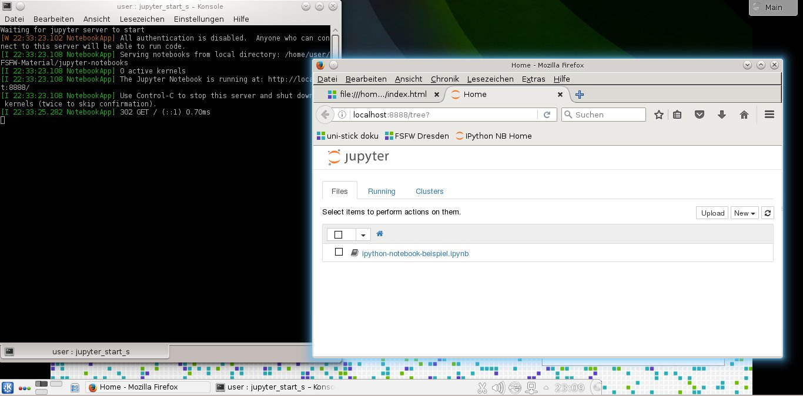
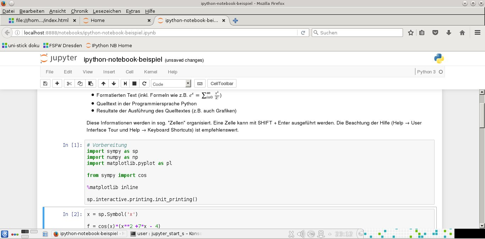
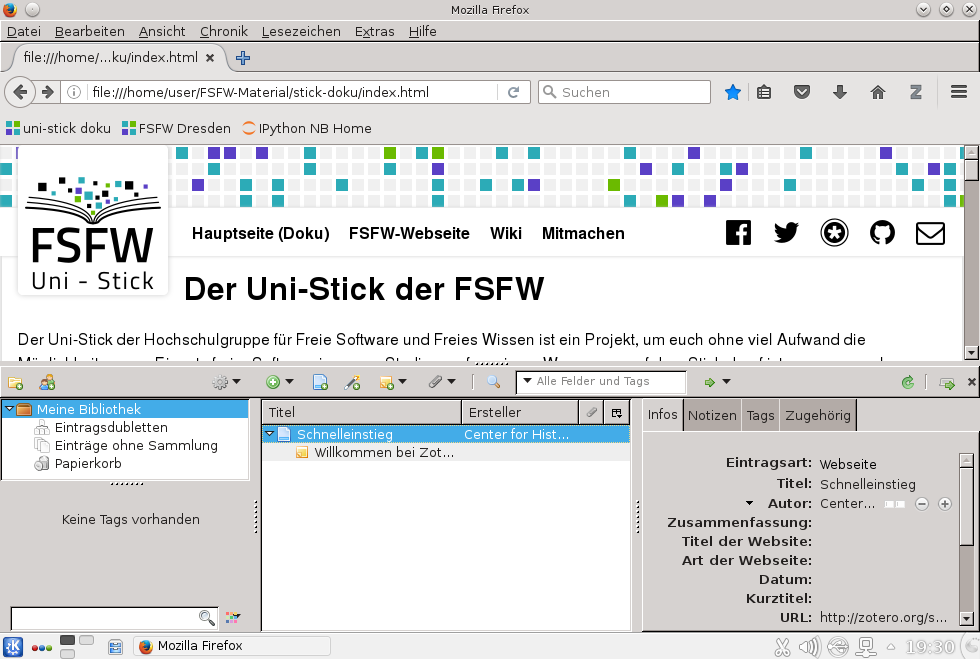
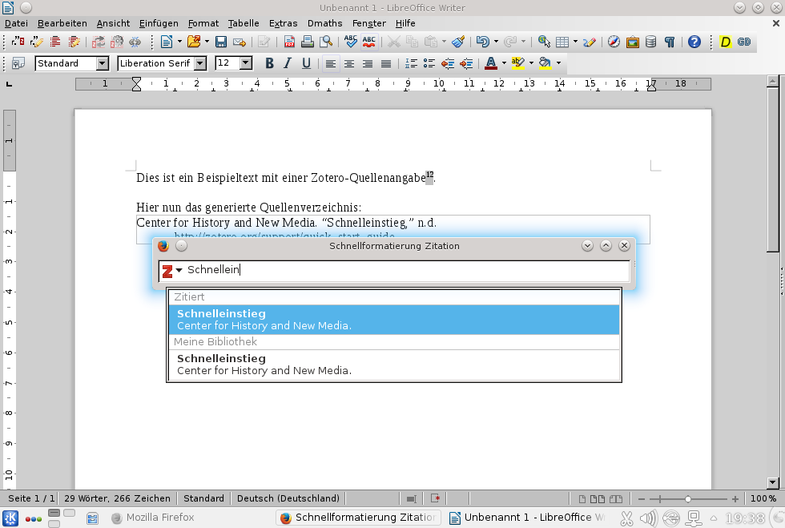
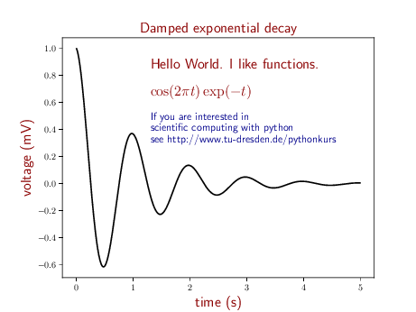

# Hintergrund und Vorgehen

Diese Datei definiert (auszugsweise) das von uns gewünschte Verhalten. Automatisierte Unittests wären deutlich eleganter sind aber technisch zu schwierig.
Jeder trägt die Programme und Funktionen ein, die er/sie für wichtig hält.

# Checkliste
## Desktop (Hintergrund und Symbole)

* Sollte ungefähr so aussehen: 
 * darauf achten, dass die Uni-Stick-spezifischen Programme räumlich von den allgemeinen Systemprogrammen getrennt sind.

## jupyter

* Klick auf Desktop-Verknüpfung "jupyter-ipython-notebook"; 5s warten
* Konsolenfenster geht auf und Firefox öffnet einen neuen Tab
 * Sieht so aus: 
* Das Beispiel-Notebook lässt sich starten
* Zellen lassen sich ohne Fehlermeldung ausführen (SHIFT + Enter)
* Sieht so aus (nur die ersten 2 Zellen ausgeführt): 

## zim

* Es ist eine Desktop-Verknüpfung dafür vorhanden
* Beim Starten wird die FSFW-zim-Vorlage geöffnet
* Sieht so aus: ![Screenshot]screenshot-zim-2017-02-15.jpg "zim Screenshot 1")
* Über das Menü: Einfügen -> Gleichung bzw. `ALT+E` `G` erreicht man den Dialog zum einfügen von LaTeX-Formeln
 * folgender String sollte ein sinnvolles Ergebnis liefern: `\alpha^2 + \beta = \frac{\pi}{2}`

## Zotero

* Es sollte als Plugin im Webbrowser und LibreOffice installiert sein.
* Beim ersten Start des Uni-Sticks sollte sich im Webbrowser die Zotero-Startseite nicht in den Vordergrund drängeln
  * Sieht so aus:  
* Webseiten oder manuell eingetragene Quellenangaben sollten sich über das Browseraddon erstellen und mittels des LibreOffice-Addon in Texte einfügen lassen
* Zusätzlich sollten sich im Browser-Addon Quellen nach Bib(La)TeX (etwa für die Verwendung in LaTeX-Dokumenten) exportieren lassen

## Accessibilityverbesserung (Screenreader & Co.)

* Brltty (Brailleterminal) soll beim booten automatisch und mit deutschsprachiger Konfig gestartet werden
* Screenreader (Linux) und NVDA (Windows) sollen in der Doku (samt Tastenkombi zum Starten) erwähnt werden.
* mit Gnome-orca/ espeak sollte ein Text vorgelesen werden können.

## LibreOffice

* Writer lässt sich über das Startmenü (K-Symbol links unten) starten. (Da hatten wir mal einen Bug).

## Datei-Assoziationen

* .md-Dateien werden mit Kate geöffnet.
* Firefox öffnet Ordner mit Dolphin (im Download-Dialog (nach Herunterladen einer Datei) -> Klick auf Ordner-Symbol)

## Tastenkombinationen

* WIN+T: öffnet ein Terminal
* WIN+K: öffnet KSnapshot (Programm für Bildschirmfotos)
* WIN+s: soll Gnome-orca öffnen

## FSFW-Doku

* In der Bookmark-Toolbar von Firefox ist ein Link auf unsere Dokumentation gut sichtbar
* Wenn man drauf klickt öffnet sich die Index-Seite mit dem FSFW-Layout
* Alle Links funktionieren, insbesondere
  - der Link auf unsere "Vollständige Paketliste", die bei github liegt (hier gab es einen Bug: #74)
  - Links auf LaTeX-Vorlagen (Diplomarbeit und Präsentation öffnen korrekt in TeX-Studio und lassen sich kompilieren)
* Index-Seite enthält die neu hinzugefügten FSFW-Links (Sprechstunde, Blog, ...)

## Kate

* Zeigt beim ersten Start keinen Tipp-Dialog
* Verwendet zum Einrücken 4 Leerzeichen
* Entfernt beim Speichern überflüssige Leerzeichen am Zeilenende

## Hello-World-Collection

* Das Verzeichnis FSFW-Material/hello-world-collection/ existiert
* Es hat die Unterverzeichnisse C, go, Python
* Die C und go-Beispiele lassen sich kompilieren und ausführen
* Die Python-Beispiele lassen sich ohne Fehlermeldungen ausführen (entsprechend der Anweisungen in python/README.md)
  * Das Matplotlib-Beispiel liefert so ein Bild: 

