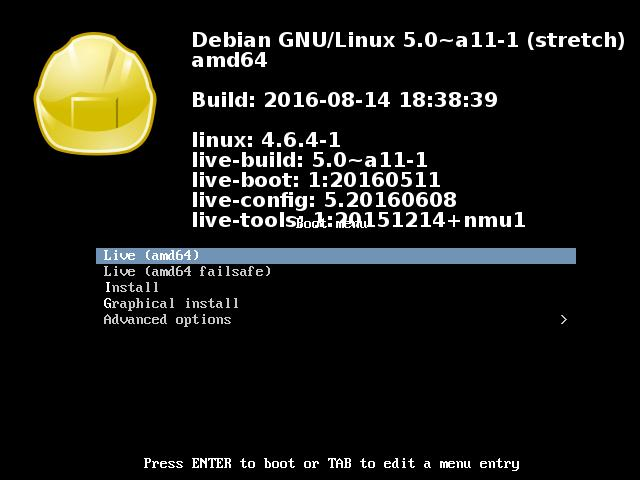
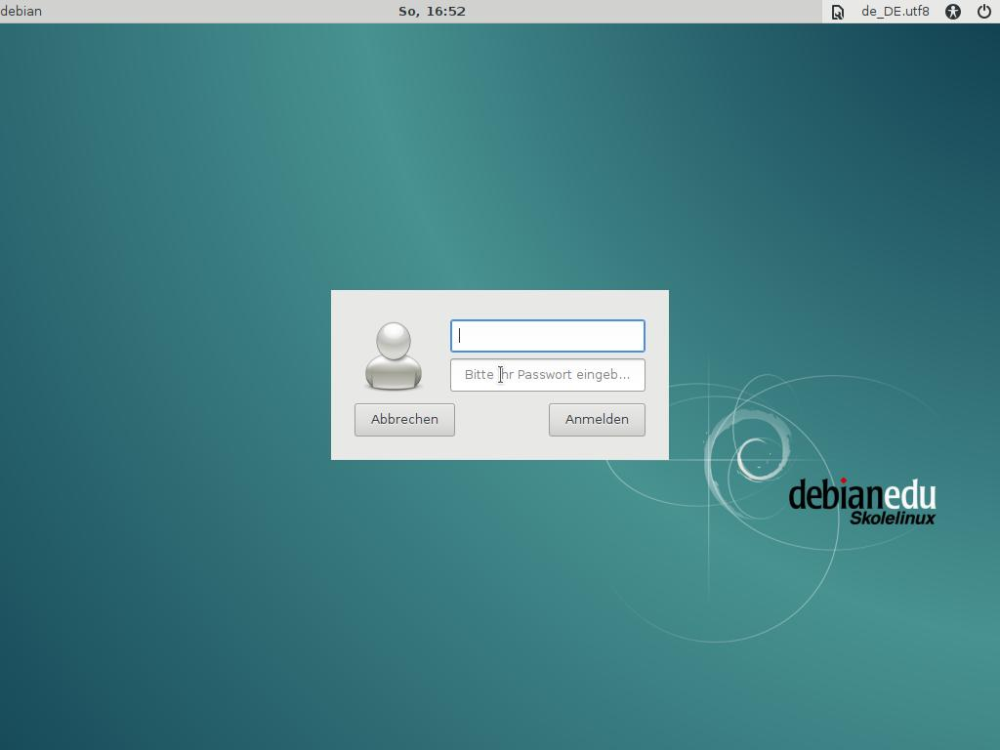
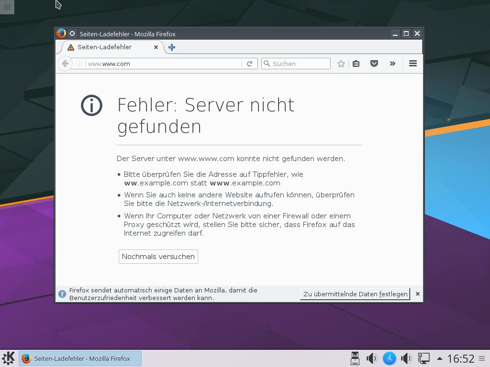

This is the configuration tree for:

  Debian KDE Desktop

A software called live-build can be used to automatically build images from
this configuration tree.

live-build can be obtained from <http://live-systems.org/devel/live-build/>.
On Debian based systems, live-build can be installed with:

  # apt-get install live-build

live-build can be used to build this image with the following command executed
in this directory::

  # lb build

More information about live-build and the Live Systems project can be found on
its homepage at <http://live-systems.org/> and in the manual at
<http://live-systems.org/manual/>.

### Eckdaten ###

|			|				|									|
|:----------------------|:-----------------------------:|:----------------------------------------------------------------------|
|Größe des Images	|? GB				|									|
|Desktopumgebung	|KDE				|Es können aber auch einige Programme aus dem Gnome etc. Umfeld dabei sein 
|Rechnerarchitektur	|Nur 64 Bit			|									|
|Lokalisiereung		|Deutsch+Englisch		|									|
|Logindaten		| ?				|									|

### So siehts aus ###

  

weitere Infos:
https://wiki.fsfw-dresden.de/doku.php/doku/usb-stick#nutzung_von_live-build_fuer_debian

