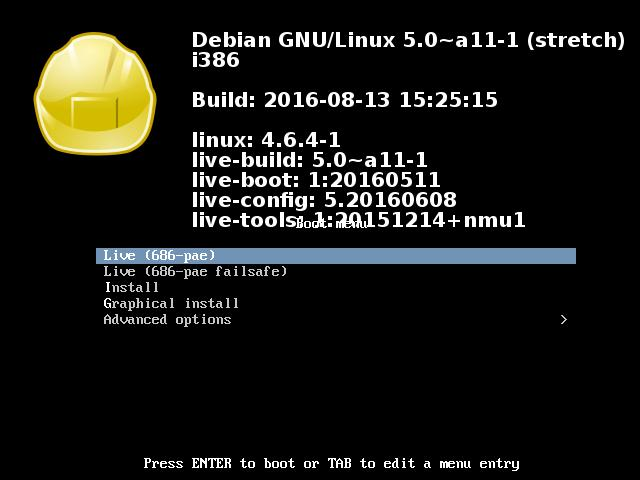
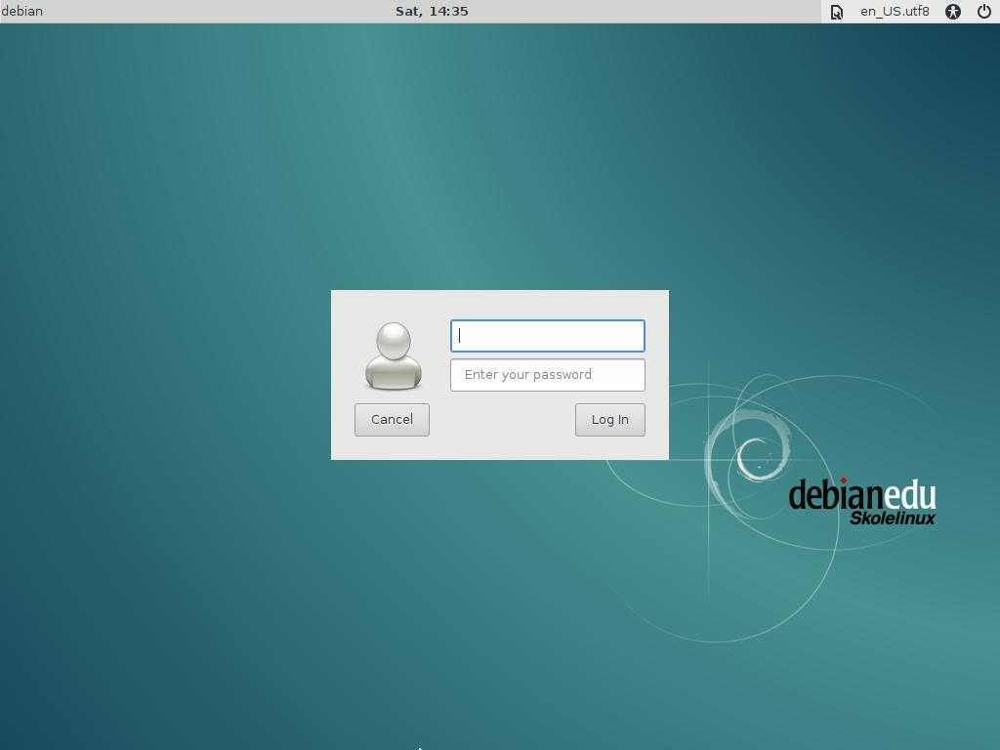
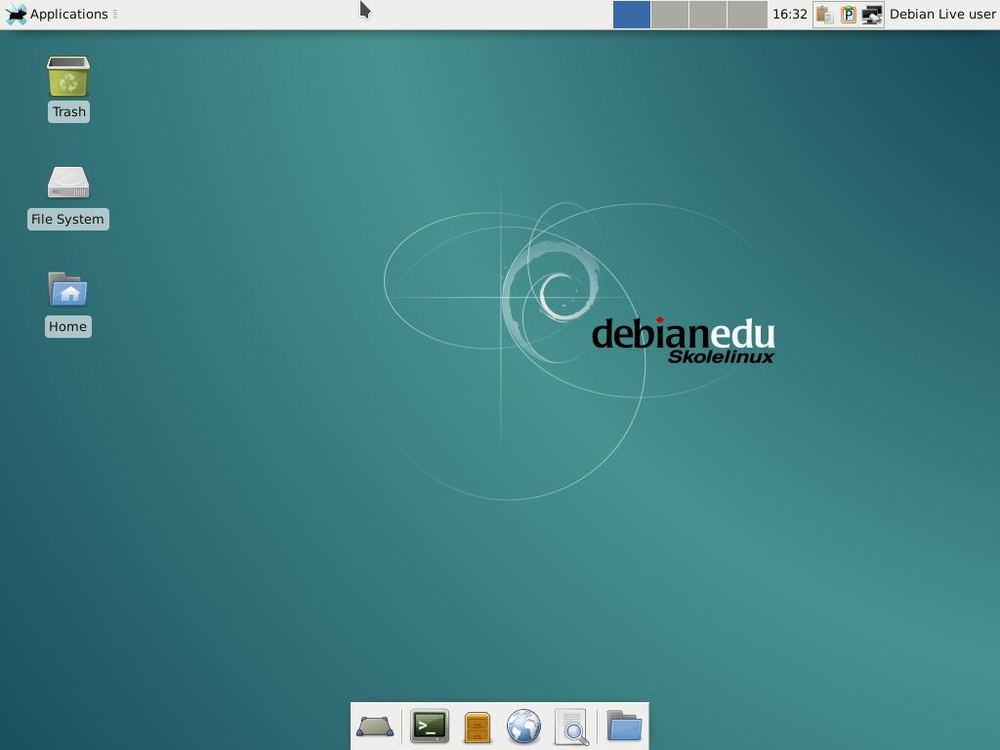

Eine Variante mit aller [gewünschter Software], aber Minidesktop (LXDE/ XFCE), damits auf die 8 GB-Sticks passt.
Außerdem soll es sowohl mit 32 als auch 64 Bit Systemen funktionieren.

### Eckdaten ###

|			|				|									|
|:----------------------|:-----------------------------:|:----------------------------------------------------------------------|
|Größe des Images	|4,6 GB				|									|
|Desktopumgebung	|LXDE + XFCE			|Es sind aber auch einige Programme aus dem KDE/ Gnome Umfeld dabei	|
|Rechnerarchitektur	|x_86 (32 Bit) ab 686-PAE	|Sollte auch auf 64 Bit Hardware laufen					|
|Lokalisiereung		|Englisch (+ Deutsch)		|Deutsch sollte zwar installiert sein, ist aber nicht auswählbar	|
|Logindaten		|Nutzer: "user", Pwd: "live"	|									|

### So siehts aus ###

  

Leider scheint mit die Paketauswahl etwas ungeeignet für Einsteiger, die Lokalisierung auf deutsch und die Netzwerkkonfig funktionieren nicht.

weitere Infos:
https://wiki.fsfw-dresden.de/doku.php/doku/usb-stick#nutzung_von_live-build_fuer_debian

