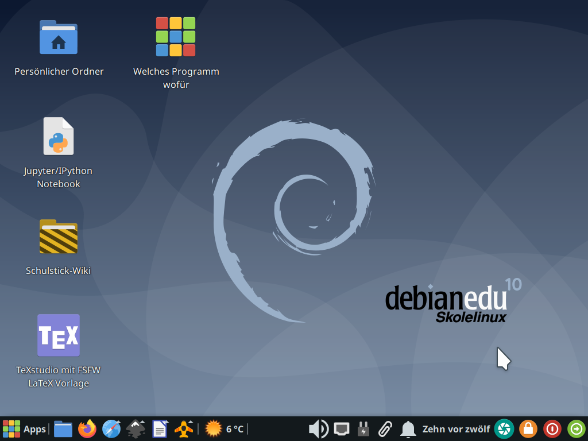

# Der Freie-Software-Freies-Wissen-Schulstick

- eine Lern-, Spiel- und Arbeitsplattform für Schüler von der Grundschule bis zum Abschluss
- mit aktueller Freier Software für viele Anwendungsbereiche
- eigenes Betriebssystem in der Tasche: lässt sich unabhängig von und ohne Gefahr für auf einem Rechner installierter Software starten
- einfache Benutzeroberfläche und verständliche Dokumentation
- Nachinstallieren weiterer Programme möglich
- mit automatischen Sicherheitsupdates
- Funktion, den Stick bei Problemen komplett oder teilweise zurückzusetzen
- erweiterbar und anpassbar, z.B. auf spezielle Bedürfnisse einer Schule (Stichwort »Schul-Proxy«…)

## Download und Bespielen eines USB-Sticks

Die aktuelle Version (1368v / 2020-04-22) basiert auf Debian-Linux 10 (stable, codename »buster«) und dem Xfce-Desktop.

Für die Installation des FSFW-Schulsticks braucht es einen 16-Gigabyte-USB-Stick guter Qualität. Weiterhin braucht man ein spezielles Programm, um das Bespielen durchzuführen. Wir empfehlen dafür den [Etcher](https://www.balena.io/etcher/), den es dort für verschiedene Betriebssysteme zum Download gibt.

> Image-Datei (7 GiB): [FSFW-Schulstick_1368v_Xfce_buster-amd64.img.bz2](http://ftp.inf.tu-dresden.de/os/FSFW/FSFW-Schulstick_1368v_Xfce_buster-amd64.img.bz2)  
> dazugehörige SHA256-Prüfsumme: [FSFW-Schulstick_1368v_Xfce_buster-amd64.img.bz2.sha256sum](http://ftp.inf.tu-dresden.de/os/FSFW/FSFW-Schulstick_1368v_Xfce_buster-amd64.img.bz2.sha256sum)

Damit einfach die komprimierte Image-Datei auswählen und auf den Stick "flashen". Das Programm verifiziert den erzeugten Stick auch, so dass bei erfolgreich vermeldetem Abschluss der Stick auch funktionieren sollte.

## Verbesserungsvorschläge — Freie Software lebt vom Mitmachen : )

Falls Probleme auftreten, ihr eine Funktion vermisst oder eine Idee habt, wie man etwas besser machen kann: einfach hier auf der Github-Projekt-Seite oben unter "Issues" suchen oder einen neuen Fall anlegen.

## Weitere Pläne / Kompetenzen gesucht

- Tutorials, walk-throughs und Challenges für auf dem Stick vorhandene Software
- Barrierefreiheit
- Multisprach-System (=> Grub Boot-Menü)
- international versions (India Africa)
- Synergien mit dem Lernstick
- ein eigenes apt-Repositorum
- …
